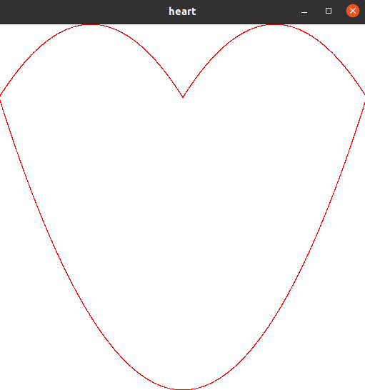

# gr1

**Задание:** Необходимо привести пример программы или библиотеки на C++, которая выводит на экран различные геометрические фигуры: круг, квадрат, треугольник, прямоугольник и т.п.
Глубина проработки примера (количество фигур, параметры, методы) на Ваше усмотрение. Программа не обязательно должна запускаться и работать (хотя это будет плюсом).

В задании Вам необходимо продемонстрировать умение использовать ООП. Просим Вас не пользоваться библиотекой QT при выполнении задания.

## Install
* Должен быть установлен **openGL**.
* Добавить *submodul*:
```sh
git submodule update --init --recursive
```
* Build
```sh
cmake -build .
```
## Запуск
```sh
./main
```

## Вывод



## Описание

В программе использовал свою собственную библиотеку для построениея граффика https://github.com/khosta77/StepanPlot.git